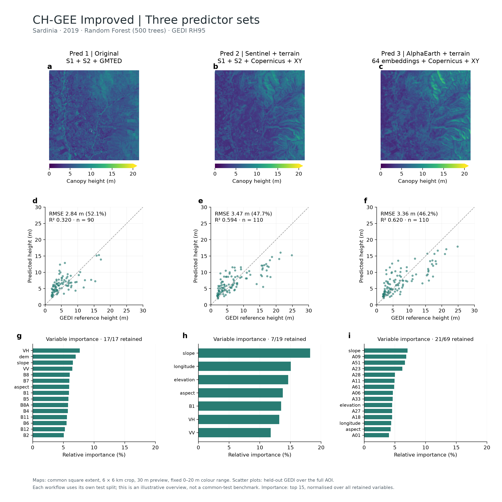

# Three-predictor overview

[Download the PDF](predictor_overview.pdf).

The figure is square (2700 × 2700 pixels), with three columns for Pred 1–3 and
three rows for canopy-height maps, scatter plots and variable importance.

- **Maps:** identical 6 × 6 km square centred on the Sardinia AOI centroid,
  EPSG:32632. The thumbnail requests a 30 m preview; it is not a 10 m raster export.
  All three use Viridis with limits of 0–20 m. The upper limit rounds the largest test prediction across the three runs (17.89 m) up to 20 m; map values above 20 m share the upper colour.
- **Scatter plots:** all available held-out GEDI observations from the full AOI,
  identical axes, dashed 1:1 line. RMSE, RMSE% and R² were independently recomputed
  from the plotted pairs and checked against Earth Engine metrics.
- **VIMP:** final-model importance, expressed as a percentage of total importance
  across all retained variables. At most 15 variables are displayed, so visible
  bars need not sum to 100%. Importance axes have a common range.

Run settings: AOI `projects/ee-calvites1990/assets/aoi_sardinia_4326`, predictor
year 2019, RF with 500 trees, GEDI RH95, all beams/day-night, no forest mask,
GEDI dates 2019-01-01 to 2020-12-31 (exclusive). Pred 1 preserves its original
workflow; Pred 2/3 use buffered sampling and mean-importance selection.

These are fresh executions of the Python interface with its pinned upstream
S1 ARD dependency. Each workflow uses its own held-out testing set. This figure
illustrates outputs; it is **not a common-test comparison or evidence of a
universally better predictor set**. It does not replace earlier UI verification
tables; cross-interface differences are documented in
[VERIFICATION.md](../validation/VERIFICATION.md).

See [figure_metrics.json](figure_metrics.json) and
[figure_settings.json](figure_settings.json) for the actual values and crop.
To reproduce, install the release dependencies plus `matplotlib` and `Pillow`,
authenticate Earth Engine, then run `python tools/make_overview.py` from the
Improved directory. The script caches report and image graphs locally so the
figure can be redrawn with `--render-only`.

